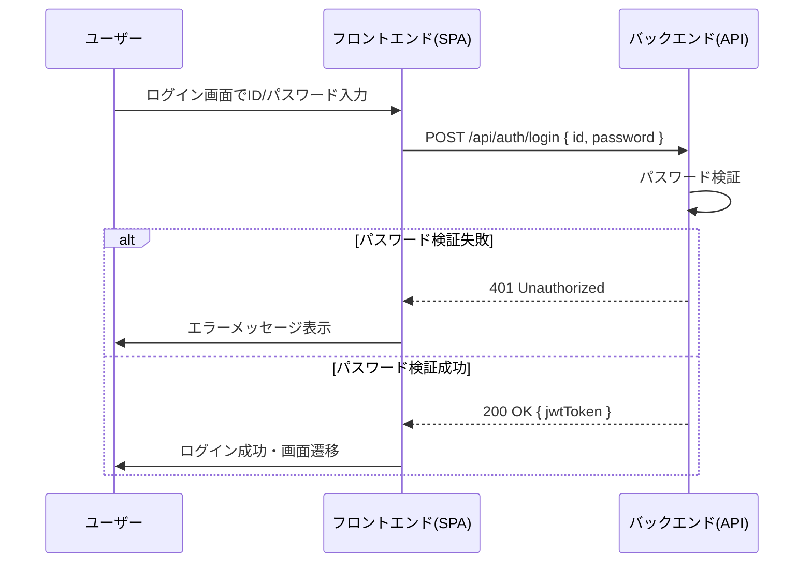
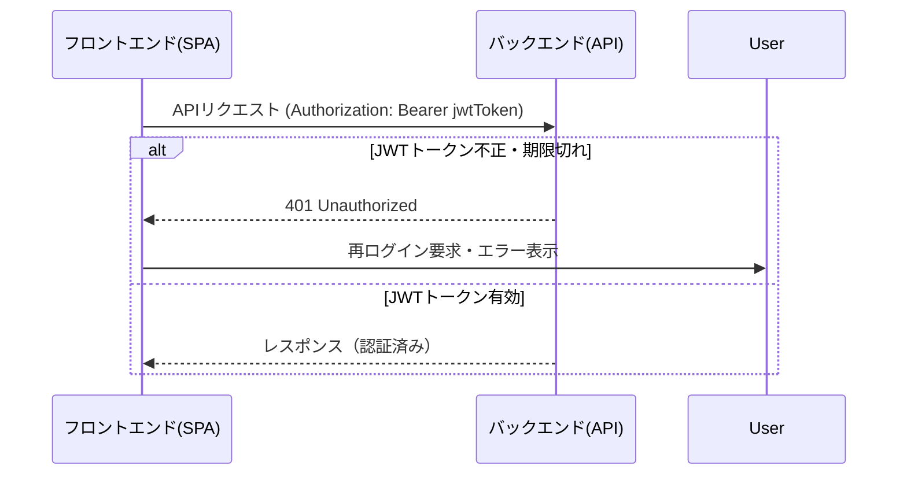

# ユーザー認証（ID/パスワード）方式設計

## 決定事項
- 本システムのユーザー認証は「ID（メールアドレス）＋パスワード」による認証とし、JWT（JSON Web Token）方式でトークンを発行・管理する。
- 認証APIはREST形式で提供し、SPA（フロントエンド）とバックエンド間の認証情報のやり取りはJWTトークンを用いる。
- セッション管理は行わず、各APIリクエスト時にJWTトークンをHTTPヘッダで送信する。

## シーケンス図（概要）

### ログイン時

### 各APIリクエスト時

## 備考
- JWTの有効期限やリフレッシュ方式、パスワードリセット等の詳細仕様は今後詰める。
- 実装時はHTTPS通信を前提とする。
