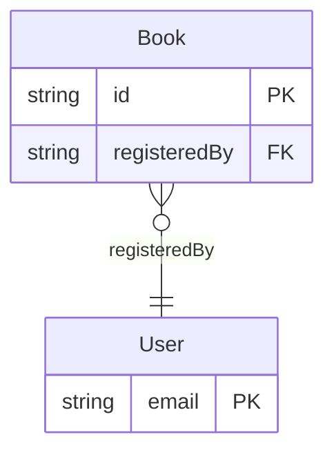

# データモデル定義

## Entity定義

### Book（書籍）

| 項目名         | 論理名         | 型       | 必須 | 制約・備考                | 例                       |
|----------------|----------------|----------|------|---------------------------|--------------------------|
| id             | 書籍ID         | string   | 〇   | 主キー、UUID              | "b1a2c3d4-..."          |
| title          | タイトル       | string   | 〇   | 255文字以内               | "リーダブルコード"       |
| author         | 著者名         | string   | 〇   | 255文字以内               | "ダスティン・ボズウェル"  |
| isbn           | ISBN           | string   |      | 13桁、ハイフン可           | "978-4873115658"        |
| location       | 保管場所       | string   |      | 255文字以内               | "3F 技術書棚"            |
| memo           | 備考・メモ     | text     |      | 改行も認める               | "2024年度新刊\nおすすめ技術書です！"   |
| purchasedAt    | 購入日         | date     |      |                           | "2024-04-01"            |
| registeredBy   | 登録者         | string   | 〇   | User.emailと紐付く         | "user1@example.com"      |
| updatedAt      | 更新日時       | datetime | 〇   | 自動更新         | "2024-05-22T10:00:00Z"   |

### User（利用者）

| 項目名         | 論理名         | 型       | 必須 | 制約・備考                | 例                       |
|----------------|----------------|----------|------|---------------------------|--------------------------|
| email          | メールアドレス | string   | 〇   | 主キー、Email形式、ユニーク| "user1@example.com"      |
| password       | パスワード     | string   | 〇   | ハッシュ化済みパスワード   | "$2b$10$..."            |
| name           | 氏名           | string   | 〇   | 255文字以内               | "山田 太郎"              |
| role           | 権限           | string   | 〇   | "member" or "admin"      | "member"                 |
| updatedAt      | 更新日時       | datetime | 〇   | 自動更新         | "2024-05-22T10:00:00Z"   |

## ER図（Mermaid記法・主キー/リレーションキーのみ）

- Book.registeredBy（外部キー）がUser.email（主キー）とN:1で紐付く
- ER図は主キー（PK）・リレーションキー（FK）のみ記載
