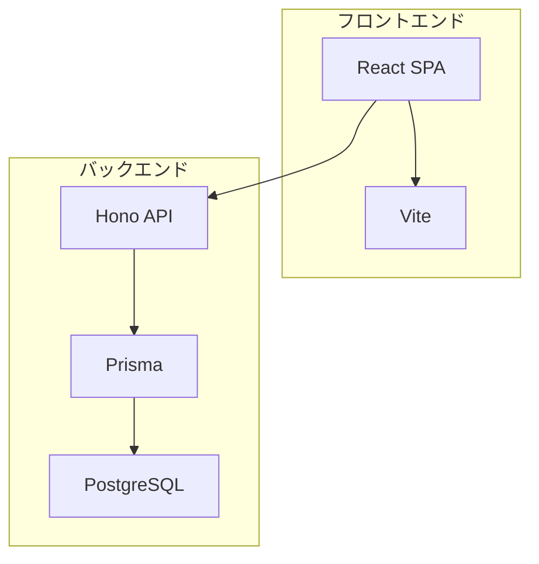
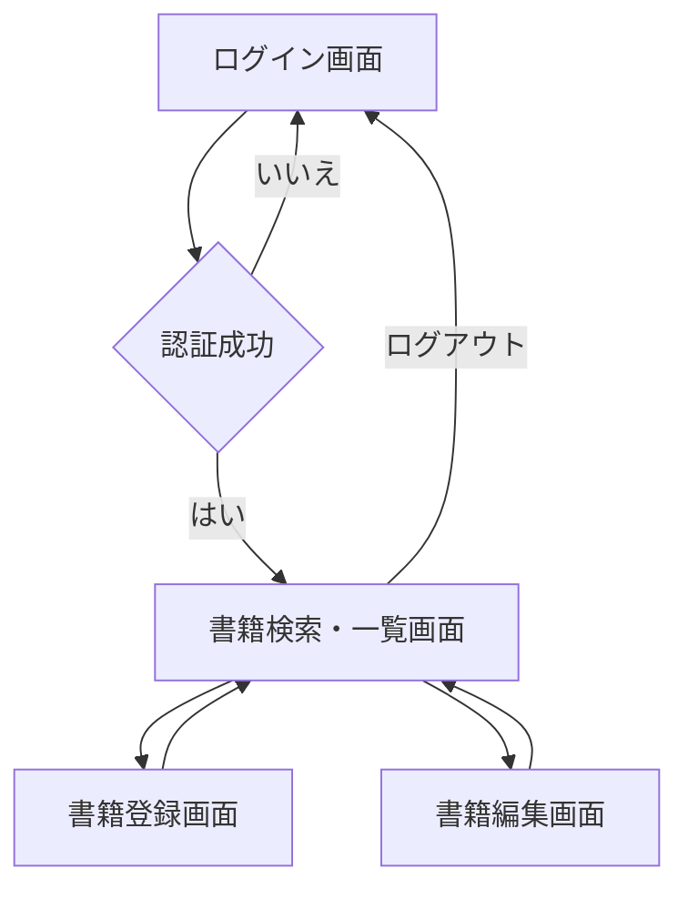

# 部門の購入書籍管理システム 要件定義書

## 1. はじめに
### 1.1 文書の目的
本書は、部門の購入書籍管理システムの要件を明確化し、今後の設計・開発・テスト・運用の指針とすることを目的とする。

### 1.2 対象システム
本要件定義書は、部門で購入した書籍を管理するWebアプリケーション（SPA）を対象とする。

### 1.3 読者
本システムの企画・開発・運用・利用に関わる全ての関係者。

### 1.4 参考資料
- [要求仕様書](../specification/要求仕様書.md)

## 2. システム概要
### 2.1 システムの目的と背景
- 部門で購入した書籍の情報を一元管理し、必要な書籍を効率的に見つけられるようにする。
- 従来のExcelや紙での管理では、書籍が増えるにつれて検索や管理が煩雑になっていた課題を解消する。

### 2.2 システムの利用者
- 一般ユーザー：主に部門のメンバー全員（約30名）
- 管理者ユーザー：システム管理・運用担当（1～2名）

### 2.3 システムの機能概要
- ユーザー認証（ID/パスワード）
- 書籍情報の検索・一覧表示
- 書籍情報の登録・編集・削除

### 2.4 システムのスコープ
- 本システムは部門内での書籍管理に限定し、他システムとの連携は行わない。
- 貸出・返却管理機能は優先度が低く、将来的な開発対象とする。

### 2.5 システム構成（物理・論理構成、技術スタック）
#### 技術スタック
- フロントエンド
  - React + TypeScript（SPAフレームワーク）
  - Vite（ビルドツール、Node.js環境で動作）
- バックエンド
  - Hono + TypeScript（WebAPIフレームワーク、Node.js環境で動作）
  - Prisma（TypeScript用ORM）
  - PostgreSQL（データベース）

#### 開発環境
- DevContainer/Docker（開発環境の標準化）
- Testcontainers（DB等のテスト用コンテナ環境、TypeScript対応）
- GitHub（ソース管理）
- VSCode（推奨エディタ）

#### 構成図

#### 特記事項
- 開発環境はDevContainerを採用し、チームでの環境統一を図る
- バックエンドはWeb標準（Fetch API）ベースのHonoを採用し、高いパフォーマンスと型安全性を確保
- データベースアクセスはPrismaを使用し、型安全なORM操作を実現

## 3. 機能要件
### 3.4 利用者管理機能（認証関連）
- ユーザー認証（ID/パスワード）
- 権限管理（一般/管理者）

### 3.2 書籍情報検索・一覧表示機能
- タイトル、著者名、ISBN、キーワード等による検索
- 書籍情報の表形式での一覧表示

### 3.1 書籍情報管理機能
- 書籍の新規登録、編集、削除

## 4. データ要件
### 4.1 エンティティ定義
- Book（書籍）
  - id（主キー、UUIDまたは連番）【必須】
  - title（タイトル）【必須】
  - author（著者名）【必須】
  - isbn（ISBN）【任意】
  - location（保管場所）【任意】
  - memo（備考・メモ）【任意】
  - purchasedAt（購入日）【任意】
  - registeredBy（登録者のユーザーemail）【必須】
  - updatedAt（更新日時）【必須】
- User（利用者）
  - email（主キー、メールアドレス）【必須】
  - password（パスワードハッシュ）【必須】
  - name（氏名または表示名）【必須】
  - role（権限：一般 or 管理者）【必須】
  - updatedAt（更新日時）【必須】

### 4.2 エンティティ関連
- 書籍エンティティと利用者エンティティは、書籍の「registeredBy」属性により関連付けられる（book:user = N:1）

## 5. 非機能要件
### 5.1 性能要件
- 部門の書籍数は最大でも数百冊程度。一般的な操作（登録、検索、一覧表示）がストレスなく行える応答速度（目安：3秒以内）を確保する。

### 5.2 可用性要件
- 業務時間中（平日9時～18時）に利用できれば十分。計画メンテナンスによる停止は許容できる。

### 5.3 セキュリティ要件
- 部門内の情報なので、外部からの不正アクセスがないように基本的なセキュリティ対策を講じる。
- ユーザー認証（簡単なID/パスワードなど）を実装する。

### 5.4 運用・保守要件
- 管理者によるユーザー管理や、定期的なDBバックアップ、障害時の対応などを想定。

### 5.5 移行要件（優先度低）
- 既存Excel台帳からのデータ移行などを想定。

### 5.6 操作性要件
- 直感的なUI、主要操作は2クリック以内、レスポンシブ対応などを想定。

## 6. 画面/UI要件
### 6.1 画面一覧
- ログイン画面：ユーザーIDとパスワードで認証を行う。
- 書籍検索・一覧画面：登録済み書籍の一覧表示、検索、詳細画面や編集画面への遷移。
- 書籍登録画面：新規書籍情報の入力・登録。
- 書籍編集画面：既存書籍情報の編集・更新。

### 6.2 画面遷移図

## 7. テスト要件
### 7.1 バックエンドテスト
- バックエンドAPIの単体テストは、API仕様を満たしていることを確認することを主目的とする。
- 単体テストはController層からRepository層までを実際のDB（例：Testcontainers等）と接続して行う統合テスト形式で記述する。
- モックやスタブは、やむを得ない場合を除き使用しない。

### 7.2 フロントエンドテスト
- UIとバックエンドを繋いだ結合テストは、主に手動で実施する。

## 8. 制約条件
### 8.1 技術的制約
- Dockerが利用可能な環境・サーバーであれば、本システムの稼働が可能であることを前提とする。

### 8.2 スケジュール
- 開発・テスト・リリースまでを1ヶ月で完了することを目標とする。

### 8.3 予算
- 小規模なシステムとして開発コストを抑える。

## 9. 今後の課題・将来開発予定
- 貸出管理機能（書籍の貸出・返却登録、貸出状況一覧、履歴参照）
- 管理者向け機能（ユーザーの登録・編集・削除、権限設定）

## 10. 更新履歴
- 2025-05-22: 初稿作成
