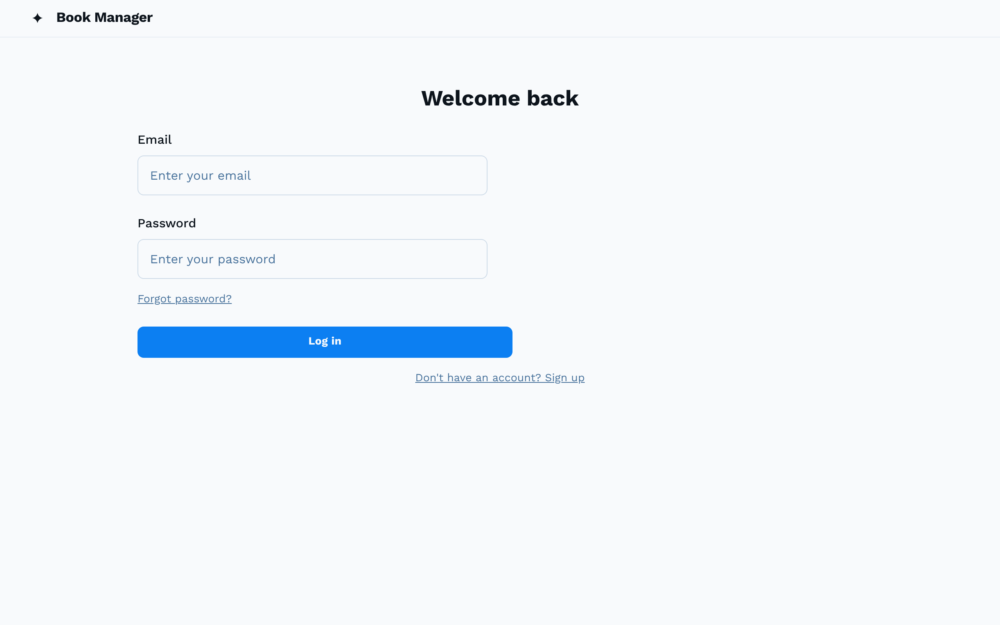

# Google Stitch ベータ版 試用レポート

## はじめに
Google I/O 2025で発表された「Stitch」のベータ版を試してみました企画

いまならまだ無料だし・・

やってみた系の記事 https://qiita.com/0xv80/items/daed022e87000ade3147 をベースに、この書籍管理アプリのUIデザインをStitchで作ってみました。

## チャレンジ内容

MVPとして、specification\要件定義書.md の下記2画面
- ログイン画面：ユーザーIDとパスワードで認証を行う。
- 書籍検索・一覧画面：登録済み書籍の一覧表示、検索、詳細画面や編集画面への遷移。


## ログイン画面デザインの試行

### まずはやってみた

chromeで公式 https://stitch.withgoogle.com/ を開いて開始

早速プロンプト入力ですか・・

まずは練習なんでベタに書いてみます。
```
ログイン画面。emailとパスワードを入力するフォーム。ログインボタンと新規登録リンクを配置する。
```
あとWebアプリ想定なので「Web」を選択

これでどうでしょうか・・40秒くらいで第一案が出てきました。

ここからあれこれ細かい注文を出してアジャストしていくのも出来そうです。

### 別パターンのプロンプト

別のプロンプトの出し方をやってみます。
要件定義書.mdの該当箇所を切り抜きで指示できないか作戦。`ユーザーID(email)`とちょっと補足した。

あと「雰囲気を設定する形容詞を定義することで、色、フォント、画像に影響を与えることができます」らしい。で下記。

下記仕様の「ログイン画面」をデザインしてください。モダンな感じでお願いします。
```
## 対象システム
部門で購入した書籍の情報を一元管理し、書籍の検索・登録・更新などを効率的に行うことを目的としたSPAアプリケーション
## 6. 画面/UI要件
### 6.1 画面一覧
- ログイン画面：ユーザーID(email)とパスワードで認証を行う。
- 書籍検索・一覧画面：登録済み書籍の一覧表示、検索、詳細画面や編集画面への遷移。
- 書籍登録画面：新規書籍情報の入力・登録。
- 書籍編集画面：既存書籍情報の編集・更新。
### 6.2 画面遷移図
    ```mermaid
    graph TD
        A[ログイン画面] --> B{認証成功};
        B --> |はい| C[書籍検索・一覧画面];
        B --> |いいえ| A;
        C --> D[書籍登録画面];
        C --> E[書籍編集画面];
        D --> C;
        E --> C;
        C --> |ログアウト| A;
    ```
```

時間はあまり変わらず・・

あんまり変わらないですね・・まあいいや第一案ベースでいきます

### 画面デザインのアジャスト

ログイン画面のアジャストです。下記を編集プロンプトに投入します・・牧歌的ってなんやねん。
・雰囲気を牧歌的に。
・各要素の縦中心をセンタリング。
・SingUpは不要なので削除。
・日本語で。


どうも今一だな・・指示も通っていないし

### Mode/モデルの切り替え

設定でStandard ModeからExperimental Modeに切り替えて使ってみます。gemini 2.5 Proの力を見せてくれ・・

素直にプロンプトを入れてみます。
```
部門で購入した書籍の情報を一元管理するWebアプリのログイン画面。emailとパスワードを入力するフォーム。日本語で表記。
```

2分くらい待って出てきたのがこちら

きたこれwww
やればできる子だったw

編集指示を段階的に入れていきます
１）forgotPasswordとSignUp、「一元管理します。」の末尾の「。」、ラベル「ログイン」はいずれも不要なので削除。
２）ラベル「ログイン」とログイン状態を保存のいずれも不要なので削除。 <- ラベル削除は反映されなかったので再度
３）copyrightを削除、画面タイトルラベルの「ログイン」を削除 <- ここでようやく反映
４）カラーセットをアースカラーに変更。背景色は薄いグラデーションで

色合いは微妙なんだけど、まあいいか・・


この辺のコントロールの具体例は下記記事が良さそうです。
https://zenn.dev/kimkiyong/articles/c374722c03f84e

> この画面で「Code」をクリックすると、HTML/CSSコードが表示されます。適当なHTMLファイルを作成し、コピーしたコードを貼り付けて保存しましょう。

[stitch\html\login.html](./html/login.html) です。
これは・・そのまま使えそうですね。

> 試しに「Appearance」を「Light」から「Dark」に変更し、「Apply theme」をクリックしてみましょう。

この操作はExperimental Modeでは使えないらしい・・残念

## 書籍検索・一覧画面デザインの試行

次は書籍検索・一覧画面のデザインにチャレンジします。

プロンプトには、上で一度挫折したmd切り抜きに、下記定義を付け足して依頼しました。Experimental Modeです。
```
### 4.1 エンティティ定義
- Book（書籍）
  - title（タイトル）【必須】
  - author（著者名）【必須】
  - isbn（ISBN）【任意】
  - location（保管場所）【任意】
  - memo（備考・メモ）【任意】
  - purchasedAt（購入日）【任意、デフォルト値 2000-01-01】
  - registeredBy（登録者のemail）【必須】
```

10分待っても返ってきませんでした・・・

指示の出し方を変え、上記内容を「UIデザイナーさんへの依頼文」に変換。もちろんGeminiさんにやってもらいましたが・・

```
依頼：書籍検索・一覧画面デザイン（API情報追記）

お疲れ様です。
部門で購入した書籍を管理するSPAアプリケーションの「書籍検索・一覧画面」のデザインをお願いいたします。

画面の目的：

登録済みの書籍情報を一覧表示し、書籍を検索したり、詳細画面や編集画面へ遷移したりできるようにします。

画面に必要な要素（仕様より抜粋）：

表示する書籍情報（Bookエンティティ）：
タイトル（必須）
著者名（必須）
ISBN（任意）
保管場所（任意）
備考・メモ（任意）
購入日（任意、デフォルト値 2000-01-01）
検索機能：
キーワード検索： タイトル、著者名、備考、登録者のemailに含まれるキーワードで検索できます。
購入日の期間検索：
開始日： いつ以降に購入された書籍を検索するか指定します。（YYYY-MM-DD形式、指定がない場合は「2000-01-01」が初期値です）
終了日： いつまでに購入された書籍を検索するか指定します。（YYYY-MM-DD形式、指定がない場合は「2099-12-31」が初期値です）
一覧表示：
登録された書籍の一覧表示
ページネーション：
ページ番号を指定できます。（指定がない場合は「1」が初期値です）
1ページあたりの表示件数を指定できます。（指定がない場合は「10件」が初期値です）
画面遷移：
書籍登録画面への遷移
書籍編集画面への遷移
（画面遷移図より）ログアウト機能
補足：書籍情報の取得APIについて

書籍の一覧情報は、下記のAPIから取得します。画面のデザインにあたっては、これらの検索条件や表示形式を考慮してください。

エンドポイント： /api/books (GETリクエスト)
検索パラメータ（クエリパラメータ）：
keyword: キーワード（文字列）
purchased_from: 購入日開始日（YYYY-MM-DD形式）
purchased_to: 購入日終了日（YYYY-MM-DD形式）
page: ページ番号（数値）
per_page: 1ページあたりの表示件数（数値）

上記を考慮して、ユーザーが書籍情報を効率的に検索・確認できるようなUIデザインをお願いいたします。特に、検索項目の配置や一覧表示の見やすさ、ページネーションの操作性などを検討いただけると幸いです。
```

2分ほどで出てきました・・丁寧にお願いしたからかな・・

結構完璧じゃないでしょうか・・
[stitch\html\search.html](./html/search.html) です。

デザインの調整は長くなるので止めておきます。

## まとめ
・使える
・デザインの調整はまだまだ手間がかかる（が今後も使い勝手は向上する見込み）
・開発プロセスとしては、このあとFigmaに落とし込んでのデザイン調整が想定されている感じですが、もういきなりReactプロジェクトに置いてCopilotに「Reactに変換して」で良い気もします・・
